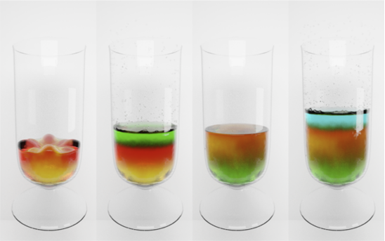
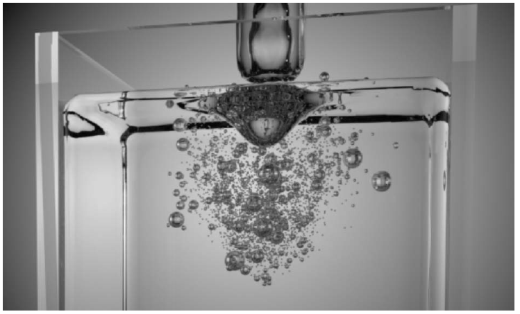
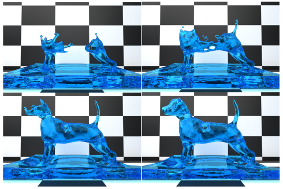
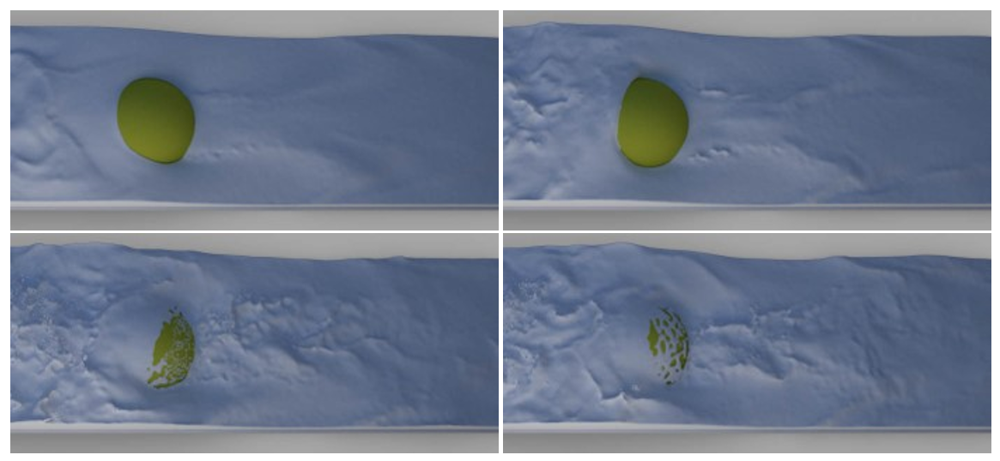

---
## Introduction

<!--from docx -->
Fluid simulation is a challenging and dynamic research area in computer graphics and animation community, which are in line with the practical demands of the visual effects and computer animation industry for high quality images. Methods offering fine fluid details, controllable art design, phase transition and diffusion phenomena are valuable for the industry. MultiFluid will develop a multilevel theory and hybrid solution with tools to provide a coherent multi-level enhancement to refine the fluid details and offer user-friendly controls in animation. Within this framework, it will develop a multi-phase interaction and phase-transition model to consider complex physics beyond the state of the art, which aims to create realistic images for computer animation and visual effects production. 

MultiFluid is designed to resolve the mismatch in digital creation. It aims to advance knowledge in physically-based modelling and fluid dynamics with a distinctive unified theoretical framework to incorporate new mathematical understanding in particle-grid based numerical simulation, which tackles computer animation production with priority but also bring new knowledge into fluid simulation with a new numerical approach and tools. This multidisciplinary research is ambitious and revolutionary to combine competencies from fluid mechanics and animation artists to benefit stakeholders directly and generate impact. 

<!--img下不能新增子文件夹-->

    

        
    

    

        
    

    

       <b>  Five Phase Cocktail </b>      
    

    

     <b> Bubbles</b> 
    

    

        
    

    

        
    

    

         <b>Fluid Control</b>      
    

    

     <b>Turbulence</b> 
    

<!-- 

    You can also have artistically styled 2/3 + 1/3 images, like these.

 -->

<!--  -->

<!-- 

 Five phase cocktail

 -->

 <!-- |     |   |
|  :----:  | :----:  |
|   |  |
|  Five phase cocktail  | Bubbles |
|   |  |
|  Fluid control  | Turbulence |
-->

[**https://www.bournemouth.ac.uk/research/projects/multifluid**](https://www.bournemouth.ac.uk/research/projects/multifluid)

[Find out more about this project on the EU CORDIS site](https://cordis.europa.eu/project/id/895941)

---

## Dissemination

Journal Papers: 
<!-- 



 -->
1. **Xiaokun Wang**, Yanrui Xu, Sinuo Liu, Bo Ren, Jiri Kosina, Alexandru C. Telea, Jiamin Wang, Chongmin Song, Jian Chang, Chenfeng Li, Xiaojuan Ban, Jianjun Zhang. “Physics-based fluid simulation: Survey, research trends, and challenges”, 1-50, Computational Visual Media, in press, 2023.
   
2. Tiancheng Wang, Yanrui Xu, Ruolan Li, Haoping Wang, Yuege Xiong, **Xiaokun Wang (corresponding author)**. “Simulating Hyperelastic Materials with Anisotropic Stiffness Models in a Particle-Based Framework”, 1-12, recommended for publication in the journal Computers & Graphics, 2022.
   
3. Xiangyang Zhou, Sinuo Liu, Haokai Zeng, **Xiaokun Wang**, Xiaojuan Ban. “Efficient and High Precision Target-driven Fluid Simulation based on Spatial Geometry Features”, 1-16, recommended for publication in the journal Computer Animation and Virtual Worlds, 2023.
   
4. **Xiaokun Wang**, Tiancheng Wang, Jiamin Wang, Yanrui Xu, Xiaojuan Ban, Houbin Huang, Zhihong Zhu, Jian Chang and Jian Jun Zhang. “Implicit smoothed particle hydrodynamics model for simulating incompressible fluid-elastic coupling”, 1-10, Computer Animation and Virtual Worlds, published online, 2023.
   
5. Yanrui Xu, Chongming Song, **Xiaokun Wang (corresponding author)**, Xiaojuan Ban, Jiamin Wang, Yalan Zhang and Jian Chang. “Spatial adaptivity with boundary refinement for smoothed particle hydrodynamics fluid simulation”, 1-10, Computer Animation and Virtual Worlds, published online, 2023.
   
6. Yanrui Xu, Yuanmu Xu, Yin Dou, Xiaojuan Ban, **Xiaokun Wang(corresponding author)**, Jian Chang and Jian Jun Zhang. “Anisotropic screen space rendering for particle-based fluid simulation”, Computers & Graphics, 2023, 110: 118-124.
   
7. Yanrui Xu, **Xiaokun Wang (corresponding author)**, Xiaojuan Ban, Jiamin Wang, Chongming Song and Yong Wang. Volume Flux free SPH Approach for Multiphase Fluids, Journal of Computer-Aided Design & Computer Graphics, 2022, 34(11): 1637-1646.

Conference paper and presentation: 

8. Tiancheng Wang, Yanrui Xu, Ruolan Li, Haoping Wang, Yuege Xiong, **Xiaokun Wang (corresponding author)**. “Simulating Hyperelastic Materials with Anisotropic Stiffness Models in a Particle-Based Framework”, 1-12, CASA 2023 AniNex workshop in Limassol, Cyprus, in May, 2023.
   
9.  Xiangyang Zhou, Sinuo Liu, Haokai Zeng, **Xiaokun Wang**, Xiaojuan Ban. “Efficient and High Precision Target-driven Fluid Simulation based on Spatial Geometry Features”, 1-16, CASA 2023 AniNex workshop in Limassol, Cyprus, in May, 2023.
    
10. **Xiaokun Wang**, Tiancheng Wang, Jiamin Wang, Yanrui Xu, Xiaojuan Ban, Houbin Huang, Zhihong Zhu, Jian Chang and Jian Jun Zhang. “Volume-based incompressible diffusion model for the simulation of silicone oil tamponade and emulsification”, 1-10, CASA 2022 AniNex workshop in Nanjing, China, in July, 2022.
    
11. Yanrui Xu, Chongming Song, **Xiaokun Wang (corresponding author)**, Xiaojuan Ban, Jiamin Wang, Yalan Zhang and Jian Chang. “Spatial Adaptivity with Boundary Refinement for SPH Fluid Simulation”, 1-10, CASA 2022 AniNex workshop in Nanjing, China, in July, 2022, Best paper award.
    
12. Yanrui Xu, Yuanmu Xu, Yin Dou, Xiaojuan Ban, **Xiaokun Wang (corresponding author)**, Jian Chang and Jian Jun Zhang. “Anisotropic Screen Space Rendering for Particle-based Fluid Simulation”, 1-10, 7.CASA 2022 AniNex workshop in Nanjing, China, in July, 2022.
    
13. Yanrui Xu, **Xiaokun Wang(corresponding author)**, Xiaojuan Ban, Jiamin Wang, Chongming Song and Yong Wang. “Volume Flux free SPH Approach for Multiphase Fluids”, CCF CAD/CG 2021+2022 Conference in Dalian, China, in August, 2022.

---

## Source Code

 [**Multiphase Code**](https://github.com/xiaokun17/multiphase)

[**Elasticity Code**](https://github.com/xiaokun17/elasticity)

[**Fluid Control Code**](https://github.com/xiaokun17/fluid-control)

[**Anisotropic SPH Rendering Code**](https://github.com/xiaokun17/ZSphRenderer)

[**Adpative Code**](https://github.com/xiaokun17/adaptive)

